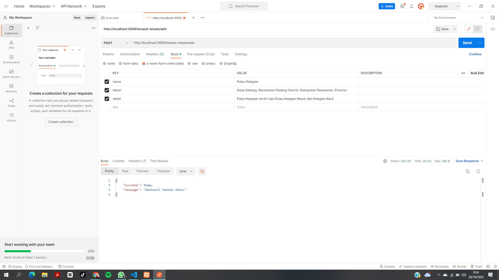
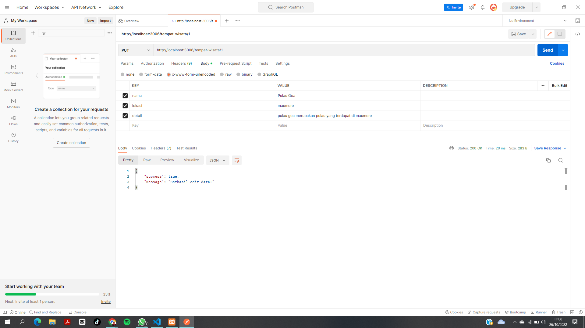
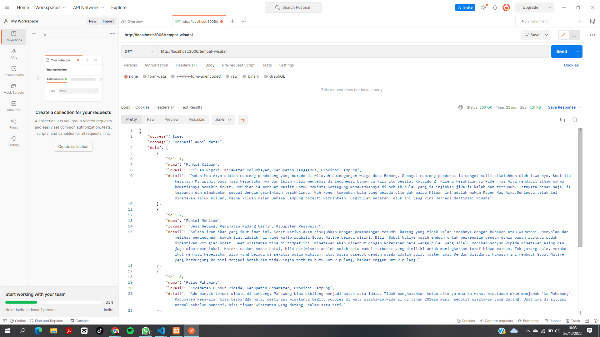
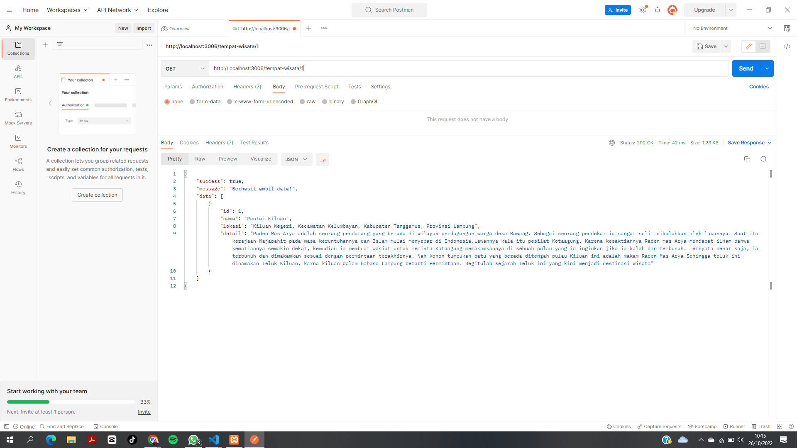
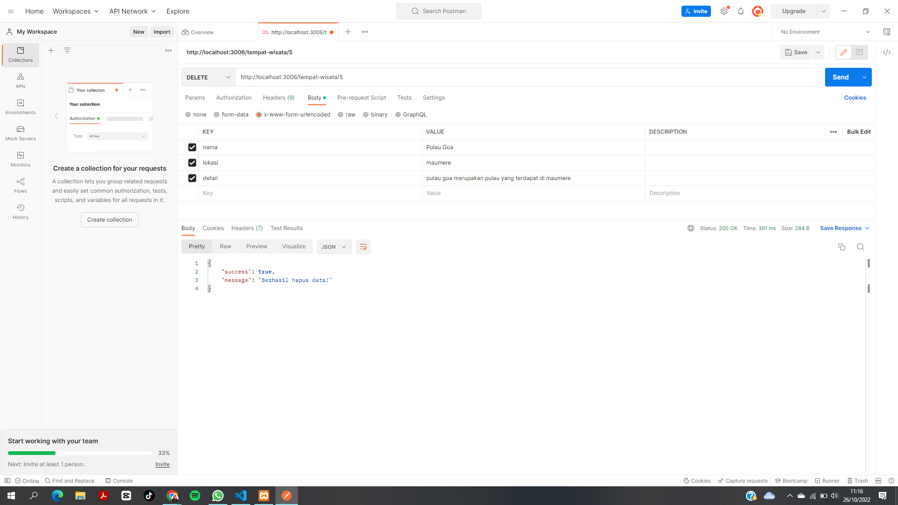

# Tugas2_PWL_119140002Eliza 

## Menmbuat Database yang diperlukan
Pada tugas kali ini membuat database tentang objek tempat wisata yang memiliki atribut id, nama, lokasi dan detail.

## Membuat project
Menggunakan perintah `npm init` pada folder project yang akan menghasilkan file package.json dan juga node modules

## Install Dependensi yang dibutuhkan
Pada tugas kali ini menginstall dependensi Express, MySQL, Body-Parser, dan Nodemon menggunakan perintah `npm install --save express mysql body-parser nodemon`

## Hasil Rest API Sederhana 

### method POST

### method PUT

### method GET

## method GET berdasarkan id

### method DELETE

